## 18 Dec

1. Just Install the dependencies to respective services
2. Create gateway folder and install express-http-proxy as an extra package.
3. Copy the respective files.

## 25 Jan

1. Update the customer model
   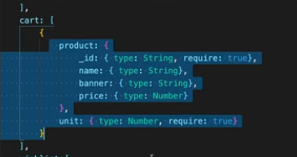
   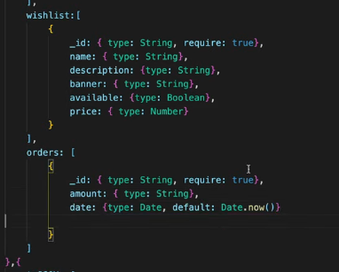

2. Update the findCustomerById
   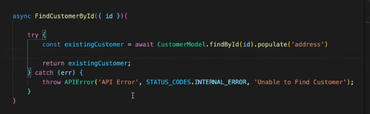

3. Update addWishListToItem controller
   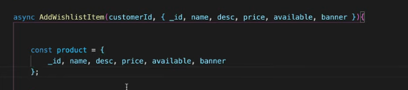

## 30 Jan

1. Update the AddCartItem controller
   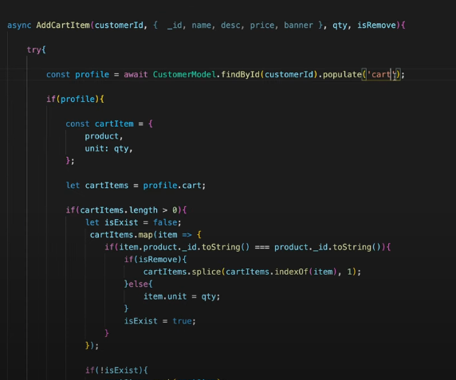

2. Now remove product and shopping repository and services.

## 31 Jan

1. Create app-event.js in src/api/app-event.js
2. What we are doing in this file is just providing a way/webhook so other applications can connect with our application
   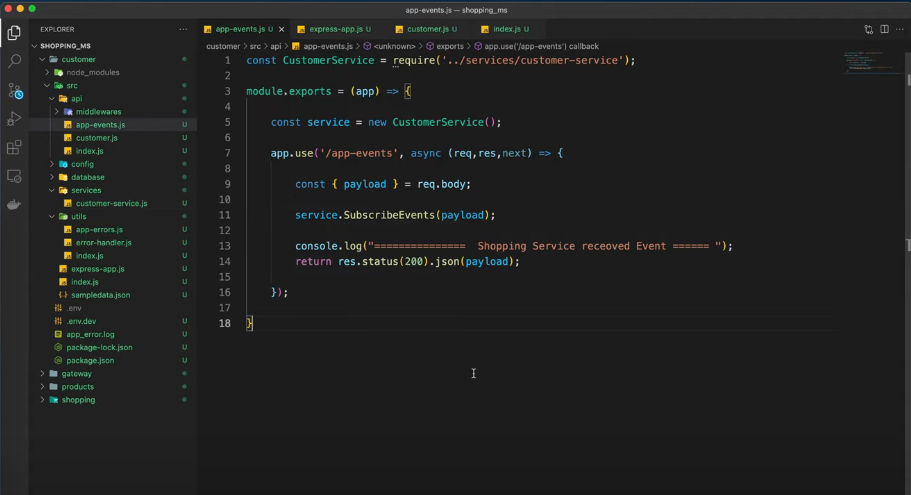
3. Update the root index.js like this
   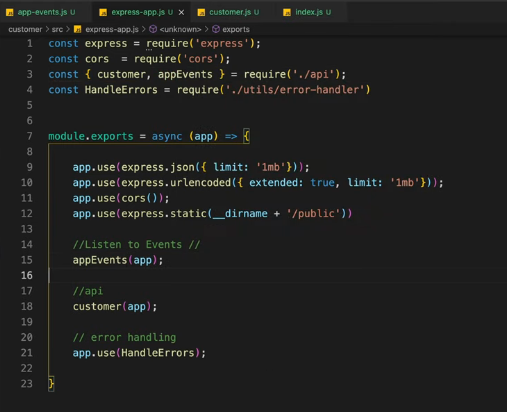
4. Use postman to test this
   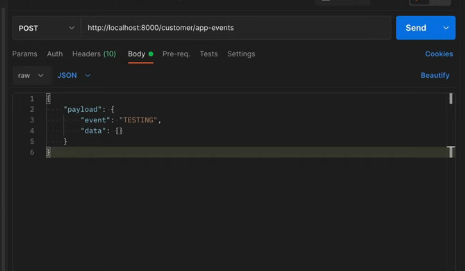
5. Now Make sure that Customer endpoints are working fine.

## 4 Feb(continue from 25)

1. Delete the address, order models from product ms
2. Delete customer and shopping repository
3. Delete customer and shopping services.
4. Create app-events.js in api folder
   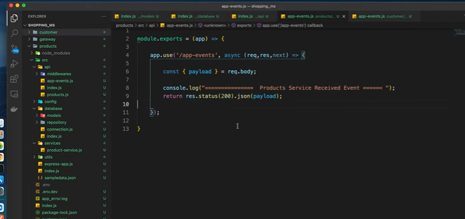

## 6 Feb

1. Install axios in product
2. Create publishCustomerEvent function and publishShoppingEvent function in utils index.js
3. In publishCustomerEvent function call customer app events endpoints.
   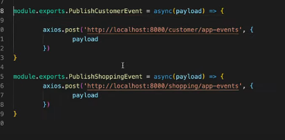
4. Create getProductPayload in product services
   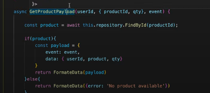
5. Update the wishlist function in product api
   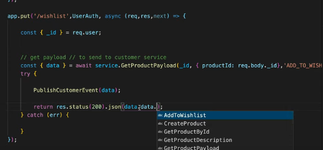
