## 18 Dec

1. Just Install the dependencies to respective services
2. Create gateway folder and install express-http-proxy as an extra package.
3. Copy the respective files.

## 25 Jan

1. Update the customer model
   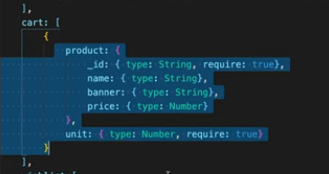
   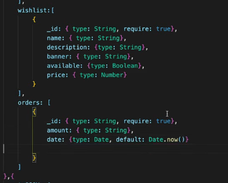

2. Update the findCustomerById
   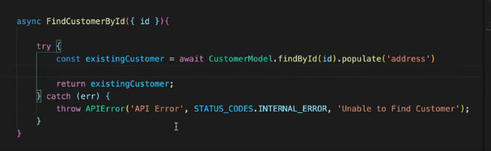

3. Update addWishListToItem controller
   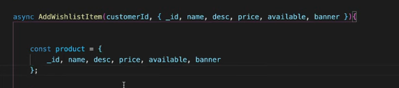

## 30 Jan

1. Update the AddCartItem controller
   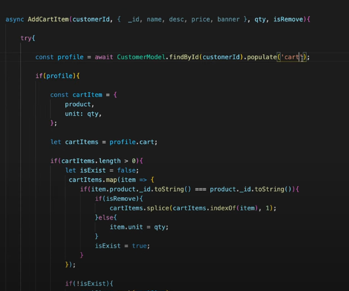

2. Now remove product and shopping repository and services.

## 31 Jan

1. Create app-event.js in src/api/app-event.js
2. What we are doing in this file is just providing a way/webhook so other applications can connect with our application
   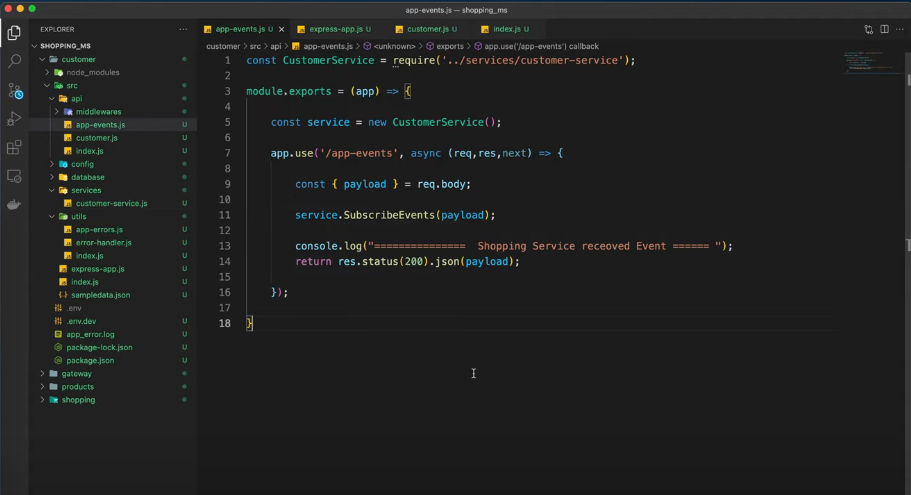
3. Update the root index.js like this
   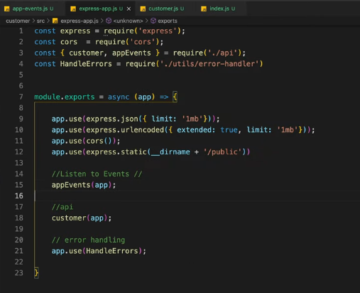
4. Use postman to test this
   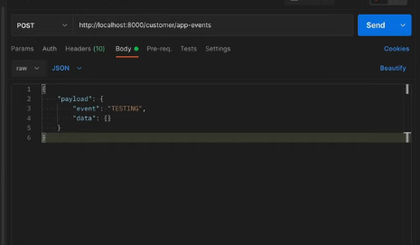
5. Now Make sure that Customer endpoints are working fine.

## 4 Feb(continue from 25)

1. Delete the address, order models from product ms
2. Delete customer and shopping repository
3. Delete customer and shopping services.
4. Create app-events.js in api folder
   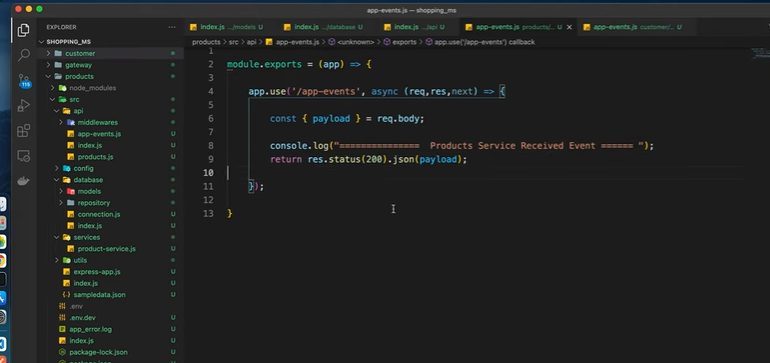

## 6 Feb

1. Install axios in product
2. Create publishCustomerEvent function and publishShoppingEvent function in utils index.js
3. In publishCustomerEvent function call customer app events endpoints.
   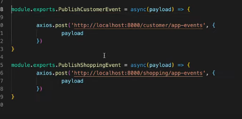
4. Create getProductPayload in product services
   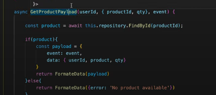
5. Update the wishlist function in product api
   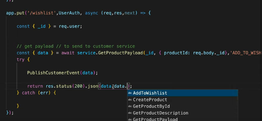

## 7 Feb(continue from 6.47)

1. Update the delete wishlist endpoint for product
   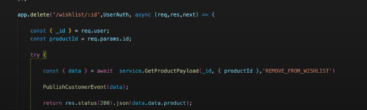
2. Update the cart controller like this
   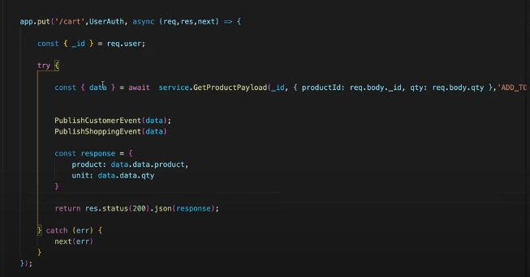
3. Update delete cart endpoint for product like this
   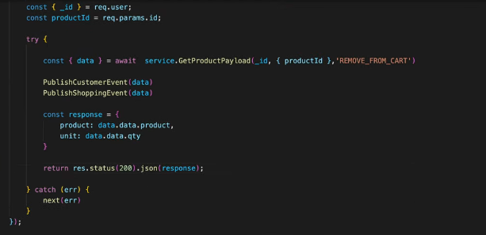

## 12 Feb

1. Delete address and customer and products from shopping
2. Add cart model like this
   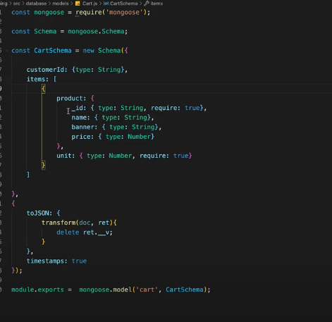
3. Update items inside the cart like this
   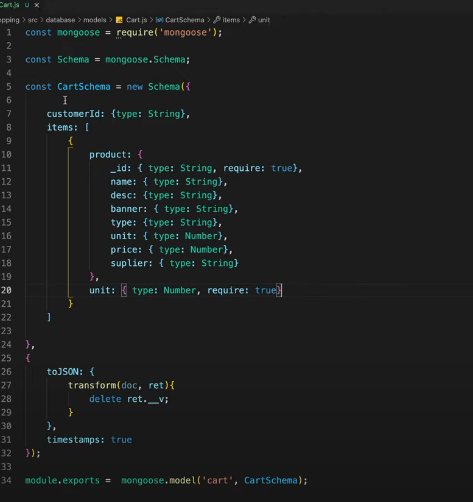
4. Update items inside orderSchema
   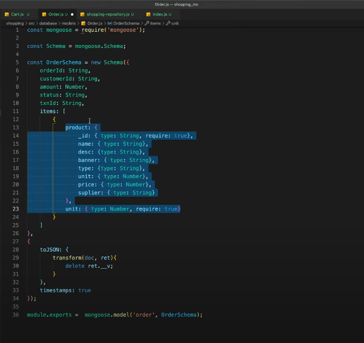
5. Remove populate from orders function in repository
6. Add new function Add to cart in orders-repository
   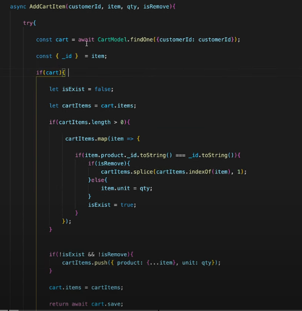
   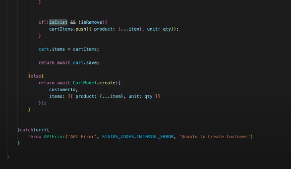
7. In Create new order function, update the profile to cart like this
   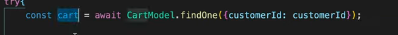

8. Update the profile.cart variable to cart.items
9. Update the last line of function like this
   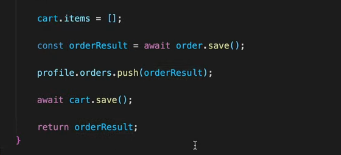
10. Add getCart function in shopping service
    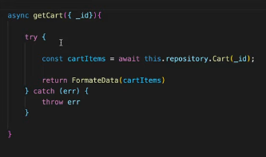
11. Add Manage Cart function
    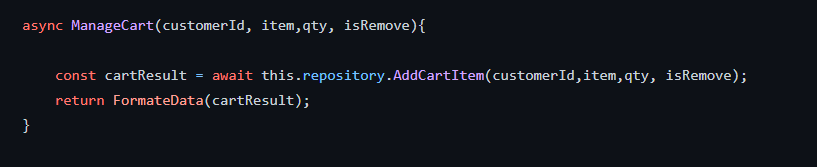

## 13 Feb

1. Remove customer and products service.
2. Remove customer and products api.
3. Follow the github repo

## 16 Feb

1. Suppose customer service is down, how we will be communicating ?
   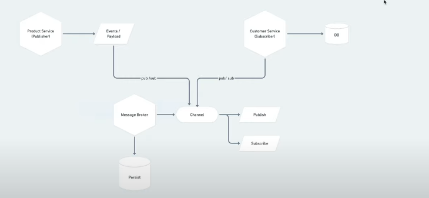

2. To solve this problem, message broker comes into the picture. we will publish the event in common channel no matter if service is down or not.
3. Delete gateway folder.
4. Remove these two function from product utils
   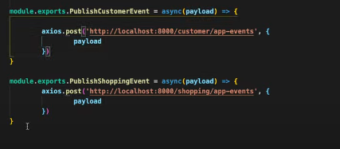
5. Download rabbitmq or cloudamqp.com and install amqplib npm in three services
6. Create three new function like this in products/utils
   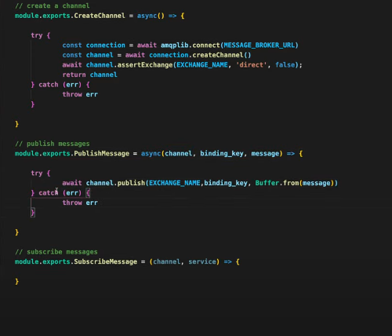

7. Subscribe message function
   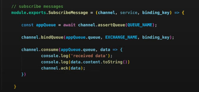

8. These are the things that is happening in above functions
   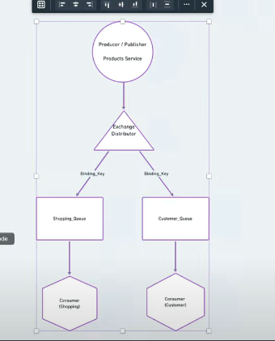

9. Add message broker url and exchange name inside the config
   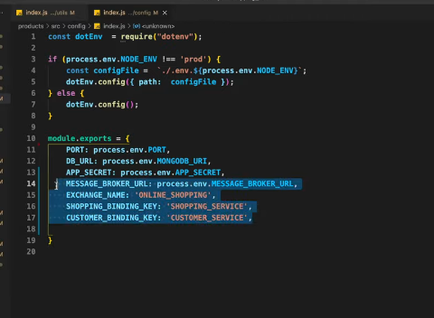

10. Add message broker url in env and import in config file.
    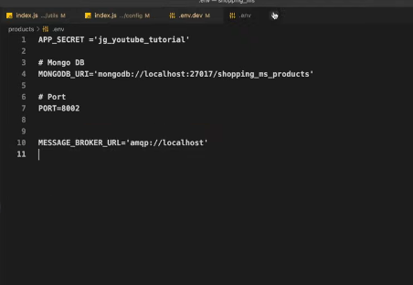

11. Create channel in root file and pass it to express app function
    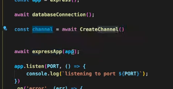

12. Pass channel in productapi function, In add wishlist function. Modify it like this
    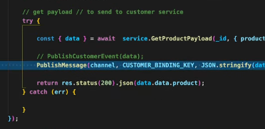

13. Wherever we are using the PublishCustomerEvent just replace it with Publish Message function.
14. Just do same for customer service and add queue name in config as "Shopping queue"
